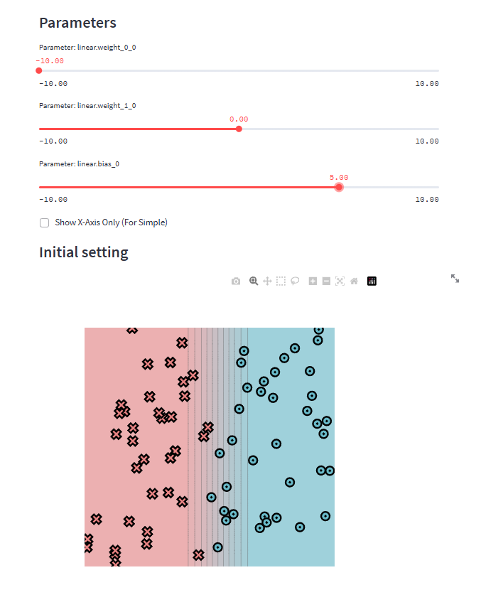

# minitorch
The full minitorch student suite. 

To access the autograder: 

* Module 0: https://classroom.github.com/a/qDYKZff9
* Module 1: https://classroom.github.com/a/6TiImUiy
* Module 2: https://classroom.github.com/a/0ZHJeTA0
* Module 3: https://classroom.github.com/a/U5CMJec1
* Module 4: https://classroom.github.com/a/04QA6HZK
* Quizzes: https://classroom.github.com/a/bGcGc12k

Визуализация для Module0:

Результаты по Module1:

Требований по обучению не было, было сказано только предоставить логи обучения.
Понимаю, что можно было обучить более сложную модель, нежели только 2 линейных слоя + RELU, как сделал я,
но как я понимаю, этого достаточно.

## Датасет: SIMPLE
Epoch  10  loss  34.9147059804924 correct 25
Epoch  20  loss  34.72195056360476 correct 25
Epoch  30  loss  34.695657118441595 correct 25
Epoch  40  loss  34.68177624586638 correct 26
Epoch  50  loss  34.66974178262566 correct 26
Epoch  60  loss  34.658434368829596 correct 26
Epoch  70  loss  34.64726663603463 correct 26
Epoch  80  loss  34.63170968695869 correct 26
Epoch  90  loss  34.354363683891926 correct 29
Epoch  100  loss  34.12356447088087 correct 32
Epoch  110  loss  33.79001445240593 correct 32
Epoch  120  loss  33.10865775948494 correct 30
Epoch  130  loss  30.14536581725812 correct 37
Epoch  140  loss  24.13231255284844 correct 47
Epoch  150  loss  15.922131965613763 correct 49
Epoch  160  loss  16.272917064014173 correct 42
Epoch  170  loss  9.859253040364516 correct 49
Epoch  180  loss  7.542007771865228 correct 49
Epoch  190  loss  6.268751823741957 correct 49
Epoch  200  loss  5.479224428373212 correct 49
Epoch  210  loss  4.918490195178987 correct 49
Epoch  220  loss  4.276137803170841 correct 49
Epoch  230  loss  3.9661310100175995 correct 49
Epoch  240  loss  3.7449321425367206 correct 49
Epoch  250  loss  3.5858321480517845 correct 49
Epoch  260  loss  3.474264362354381 correct 49
Epoch  270  loss  3.6504262127761637 correct 49
Epoch  280  loss  3.590205560399897 correct 49
Epoch  290  loss  3.314085863508014 correct 49
Epoch  300  loss  3.113249591661093 correct 49
Epoch  310  loss  3.262556934288463 correct 49
Epoch  320  loss  3.1301254792735658 correct 49
Epoch  330  loss  3.037232557651205 correct 49
Epoch  340  loss  2.9951382182113155 correct 49
Epoch  350  loss  2.9560647727602793 correct 49
Epoch  360  loss  2.9114289487318383 correct 49
Epoch  370  loss  2.8709866653021536 correct 49
Epoch  380  loss  2.8330389490831838 correct 49
Epoch  390  loss  2.6832390771556294 correct 49
Epoch  400  loss  2.5660073498120277 correct 49
Epoch  410  loss  2.621941674945161 correct 49
Epoch  420  loss  2.6350081426848715 correct 49
Epoch  430  loss  2.613793728316895 correct 49
Epoch  440  loss  2.5889191580160325 correct 49
Epoch  450  loss  2.559909916364795 correct 49
Epoch  460  loss  2.542485118741607 correct 49
Epoch  470  loss  2.5209117581354517 correct 49
Epoch  480  loss  2.4971858788753862 correct 49
Epoch  490  loss  2.4740755269380865 correct 49
Epoch  500  loss  2.450990586785958 correct 49

## Датасет: DIAG
Epoch  10  loss  13.469041394440394 correct 46
Epoch  20  loss  13.008325787592819 correct 46
Epoch  30  loss  12.608955747525966 correct 46
Epoch  40  loss  12.226385875026844 correct 46
Epoch  50  loss  11.836652359536071 correct 46
Epoch  60  loss  11.422087111309695 correct 46
Epoch  70  loss  10.966791853329196 correct 46
Epoch  80  loss  10.454470837361917 correct 46
Epoch  90  loss  9.86781437294248 correct 46
Epoch  100  loss  9.19013072947707 correct 46
Epoch  110  loss  8.41117867338949 correct 46
Epoch  120  loss  7.539028697985794 correct 46
Epoch  130  loss  6.613869616722088 correct 46
Epoch  140  loss  5.706635678432379 correct 47
Epoch  150  loss  4.885482116332667 correct 48
Epoch  160  loss  4.227949158151309 correct 48
Epoch  170  loss  3.7412077380872395 correct 49
Epoch  180  loss  3.361014118422309 correct 50
Epoch  190  loss  3.0619553636509416 correct 50
Epoch  200  loss  2.824518483963603 correct 50
Epoch  210  loss  2.6085979516306392 correct 50
Epoch  220  loss  2.414920422239267 correct 50
Epoch  230  loss  2.2412144344724627 correct 50
Epoch  240  loss  2.084445031664885 correct 50
Epoch  250  loss  1.9425934583637663 correct 50
Epoch  260  loss  1.813938602879668 correct 50
Epoch  270  loss  1.696407217272208 correct 50
Epoch  280  loss  1.5887395020416994 correct 50
Epoch  290  loss  1.4900599694247025 correct 50
Epoch  300  loss  1.3994186409648128 correct 50
Epoch  310  loss  1.3158908488749093 correct 50
Epoch  320  loss  1.238801630661616 correct 50
Epoch  330  loss  1.167557046778639 correct 50
Epoch  340  loss  1.1016313251037975 correct 50
Epoch  350  loss  1.0405747629393476 correct 50
Epoch  360  loss  0.9839535292922944 correct 50
Epoch  370  loss  0.931381330216015 correct 50
Epoch  380  loss  0.88252106486102 correct 50
Epoch  390  loss  0.8370715287806509 correct 50
Epoch  400  loss  0.8092374532514797 correct 50
Epoch  410  loss  0.7692081900061964 correct 50
Epoch  420  loss  0.7194645346233767 correct 50
Epoch  430  loss  0.6854156920851343 correct 50
Epoch  440  loss  0.6640429015830233 correct 50
Epoch  450  loss  0.6237057867372141 correct 50
Epoch  460  loss  0.5959165642295399 correct 50
Epoch  470  loss  0.5777400361665374 correct 50
Epoch  480  loss  0.5448962692478434 correct 50
Epoch  490  loss  0.5220338671032153 correct 50
Epoch  500  loss  0.5065376122127394 correct 50

## Датасет: SPLIT
Epoch  10  loss  34.19240243642183 correct 31
Epoch  20  loss  33.27741509663716 correct 31
Epoch  30  loss  33.20900590794596 correct 31
Epoch  40  loss  33.20358367094722 correct 31
Epoch  50  loss  33.203145182574396 correct 31
Epoch  60  loss  33.20310950051343 correct 31
Epoch  70  loss  33.20310658870157 correct 31
Epoch  80  loss  33.203106350053375 correct 31
Epoch  90  loss  33.20310633023043 correct 31
Epoch  100  loss  33.20310632850972 correct 31
Epoch  110  loss  33.203106328339615 correct 31
Epoch  120  loss  33.203106328317205 correct 31
Epoch  130  loss  33.20310632831297 correct 31
Epoch  140  loss  33.20310632831189 correct 31
Epoch  150  loss  33.2031063283116 correct 31
Epoch  160  loss  33.20310632831154 correct 31
Epoch  170  loss  33.20310632831152 correct 31
Epoch  180  loss  33.20310632831153 correct 31
Epoch  190  loss  33.20310632831151 correct 31
Epoch  200  loss  33.2031063283115 correct 31
Epoch  210  loss  33.203106328311506 correct 31
Epoch  220  loss  33.203106328311506 correct 31
Epoch  230  loss  33.20310632831154 correct 31
Epoch  240  loss  33.2031063283115 correct 31
Epoch  250  loss  33.20310632831148 correct 31
Epoch  260  loss  33.20310632831151 correct 31
Epoch  270  loss  33.20310632831151 correct 31
Epoch  280  loss  33.20310632831152 correct 31
Epoch  290  loss  33.20310632831152 correct 31
Epoch  300  loss  33.20310632831151 correct 31
Epoch  310  loss  33.20310632831151 correct 31
Epoch  320  loss  33.20310632831151 correct 31
Epoch  330  loss  33.20310632831151 correct 31
Epoch  340  loss  33.20310632831151 correct 31
Epoch  350  loss  33.20310632831151 correct 31
Epoch  360  loss  33.20310632831151 correct 31
Epoch  370  loss  33.20310632831151 correct 31
Epoch  380  loss  33.20310632831151 correct 31
Epoch  390  loss  33.20310632831151 correct 31
Epoch  400  loss  33.20310632831151 correct 31
Epoch  410  loss  33.20310632831151 correct 31
Epoch  420  loss  33.20310632831151 correct 31
Epoch  430  loss  33.20310632831151 correct 31
Epoch  440  loss  33.20310632831151 correct 31
Epoch  450  loss  33.20310632831151 correct 31
Epoch  460  loss  33.20310632831151 correct 31
Epoch  470  loss  33.20310632831151 correct 31
Epoch  480  loss  33.20310632831151 correct 31
Epoch  490  loss  33.20310632831151 correct 31
Epoch  500  loss  33.20310632831151 correct 31

## Датасет: XOR
Epoch  10  loss  34.24585801711871 correct 26
Epoch  20  loss  34.10685534536651 correct 27
Epoch  30  loss  34.025678132404536 correct 27
Epoch  40  loss  33.939728982521586 correct 27
Epoch  50  loss  33.8426930688278 correct 27
Epoch  60  loss  33.727485526249254 correct 27
Epoch  70  loss  33.587319770272224 correct 27
Epoch  80  loss  33.4068557537442 correct 28
Epoch  90  loss  33.17858730023853 correct 30
Epoch  100  loss  32.869807888192604 correct 30
Epoch  110  loss  32.46711097032477 correct 34
Epoch  120  loss  31.945388088756385 correct 35
Epoch  130  loss  31.25438257620459 correct 37
Epoch  140  loss  30.367869053516344 correct 37
Epoch  150  loss  29.266932630120255 correct 37
Epoch  160  loss  27.774224576054635 correct 39
Epoch  170  loss  25.788001450279868 correct 42
Epoch  180  loss  42.11780150088257 correct 28
Epoch  190  loss  24.175082421767055 correct 47
Epoch  200  loss  24.15867950133737 correct 39
Epoch  210  loss  27.486909213367156 correct 33
Epoch  220  loss  15.251652981445764 correct 49
Epoch  230  loss  18.993273674862536 correct 41
Epoch  240  loss  22.802196214728653 correct 37
Epoch  250  loss  18.460433029119358 correct 40
Epoch  260  loss  19.464734289693123 correct 39
Epoch  270  loss  15.315499972454132 correct 42
Epoch  280  loss  15.132210548693143 correct 42
Epoch  290  loss  15.915562330374353 correct 42
Epoch  300  loss  13.086908663769632 correct 44
Epoch  310  loss  11.686825158337376 correct 45
Epoch  320  loss  13.458806581971555 correct 44
Epoch  330  loss  12.338657477780897 correct 45
Epoch  340  loss  8.391147416449408 correct 47
Epoch  350  loss  7.754206424581021 correct 48
Epoch  360  loss  11.060017818568772 correct 45
Epoch  370  loss  12.562445460531043 correct 44
Epoch  380  loss  6.809063597292038 correct 48
Epoch  390  loss  5.317769427083664 correct 49
Epoch  400  loss  5.308102199324859 correct 49
Epoch  410  loss  7.633370774139006 correct 48
Epoch  420  loss  9.48619000827863 correct 46
Epoch  430  loss  8.128381373956124 correct 47
Epoch  440  loss  6.636316530686422 correct 48
Epoch  450  loss  5.210916047317759 correct 49
Epoch  460  loss  4.331518695417678 correct 49
Epoch  470  loss  4.137426254380483 correct 49
Epoch  480  loss  4.359857163219714 correct 49
Epoch  490  loss  7.659671732059247 correct 47
Epoch  500  loss  7.4285919993757 correct 48
